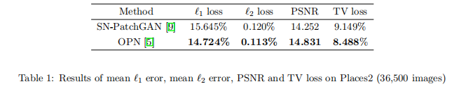

# ObjectRemoval
Based on code from: \
https://github.com/StanfordVL/GibsonEnv \
https://github.com/StanfordVL/3DSceneGraph \
https://github.com/seoungwugoh/opn-demo \
https://github.com/JiahuiYu/generative_inpainting \
The licenses are included in the above links.





## Installation

Follow the instructions in the 4 internal README files to download and install the relevant data, code, models and dependencies. \
Save the 3DSceneGraph folder ("verified_graph") under GibsonEnv/gibson/assets.

## Usage

Build the panoramic masks for all models with:

```bash
cd 3DSceneGraph 
bash load.sh
```
or for one model with:

```bash
cd 3DSceneGraph 
python load.py --model model_name
```


To run object removal for one model: \
Run:
```bash
cd opn 
python gibson_inpaint.py --model model_name
```
The rendered input is in "Image_inputs" and the the inpainted output in "Image_results".

To run object removal for all models:

```bash
python inpaint.sh
```

To reproduce the experiments on Places2:

Download [Places2](http://data.csail.mit.edu/places/places365/val_256.tar) and save under "generative_inpainting/examples/val_256"

Test on OPN:
```bash
cd opn 
python test_places2.py
```

Test on SN-PatchGAN:
```bash
cd generative_inpainting 
python test_places2.py --checkpoint_dir model_logs/release_places2_256
```

Evaluate:
```bash
python eval.py
```
